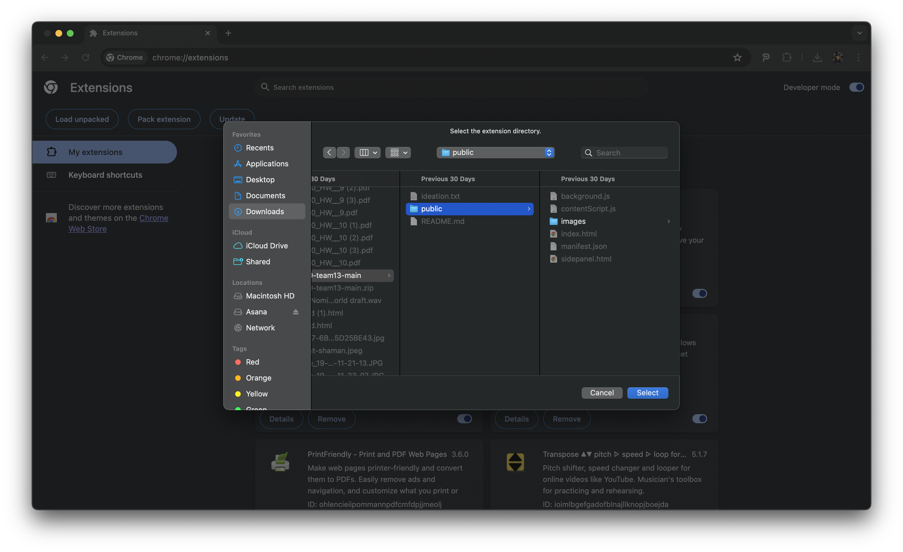

# TypeMaster Chrome Extension

## Introduction

Welcome to TypeMaster, your ultimate tool for enhancing your writing experience across various platforms! Whether you're drafting emails, completing assignments, or crafting social media posts, it doesn't matter if your website doesn't have word counts, because TypeMaster provides real-time word counting and stylistic feedback to refine your text. Our friendly mascot is here to guide you through your writing journey, making sure every word counts! Built with :coffee: by James Huang, Tiffany Lian, Sanya Shetty, and Alec Dempsey.

## Features

- **Word Count Anywhere**: Instantly see how many words you've written in any text field within your browser.
- **Style Improvements**: Get suggestions on how to make your writing clearer and more professional.
- **Seamless Integration**: Works quietly in the background with a simple interface to access whenever you need it.

## Installation

Follow these simple steps to install TypeMaster on your Chrome browser:

1. **Download the Extension**: Download the `TypeMaster.zip` file from our repository.
2. **Open Chrome Extensions**: Navigate to `chrome://extensions/` in your Chrome browser.
3. **Enable Developer Mode**: At the top right of the extensions page, toggle the developer mode to enable installation from unpacked archives.
4. **Load Unpacked Extension**: Click on 'Load unpacked' and select the unzipped folder for TypeMaster from your computer.

Now, TypeMaster is ready to assist you with your writing directly in your Chrome browser!

## Setup

To get started with TypeMaster, you need to set up your API key for OpenAI, which powers our style suggestions. Please note that you must use a key linked to an account with a paid subscription as our platform utilizes OpenAI's GPT 3.5 Turbo:

1. **Open the Extension**: Click on the TypeMaster icon in your browser's extension tray.
2. **Navigate to Setup**: You will be greeted by a setup page asking for your OpenAI API key.

 <!-- TODO: Replace with the path to setup page screenshot -->

3. **Enter Your OpenAI API Key**: Find your key from your OpenAI account and paste it into the setup field.
4. **Save and Ready**: Hit save, and you're all set to go!

## Extension in Action

Once you have TypeMaster set up, using it is as simple as highlighting text on any web page. Just select the text you've written and click on the TypeMaster icon to open the side panel. You can also access TypeMaster by right-clicking on highlighted text and choosing "Open side panel". Here, you'll see:

- **Word Count**: Immediate display of the total words and characters.
- **Professional Feedback**: Suggestions to improve your writing style and clarity.

 <!-- TODO: Replace with the path to action screenshot -->

## Why TypeMaster?

TypeMaster isn't just another extension; it's your partner in effective communication. It's built to ensure your writing is not only error-free but also impactful and clear. Whether you're a student, a professional, or someone who just loves writing, TypeMaster is designed to help you express yourself better.

You can read more about our design process in our Medium article [here](https://medium.com/@jamesjinghuang/creating-typemaster-an-llm-powered-chrome-extension-80756878fd71)

## Feedback and Contributions

We love to hear from our users and encourage everyone to contribute to making TypeMaster even better! If you have feedback, suggestions, or have encountered an issue, please let us know by [filing an issue](https://github.com/jameshu88/typemasterai/issues) in our GitHub repository.

Feel free to report bugs, request features, or suggest improvements. We are committed to fostering a welcoming and constructive community.
